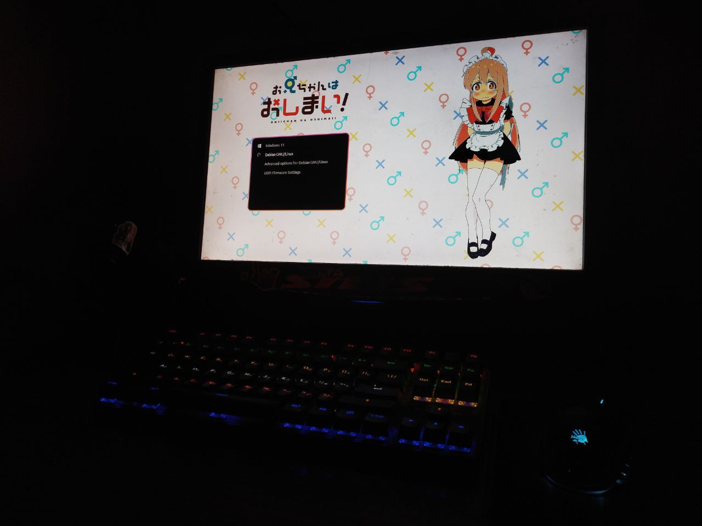

<!-- PROJECT LOGO -->
 

  

  <h3 align="center">Mahiro Grub Theme</h3>

  

    Created by fans for fans!
     
     
     
  

<!-- ABOUT THE PROJECT -->
## About The Project
The idea to create such a topic came to my mind completely by accident. I have heard in the past that it is possible to install a theme on Grub. Recently I've been wondering about it, started searching for themes and realized that there are no suitable themes on the Internet and decided to create my own one. So this theme appeared)))

## Installation methods 
1. [youtube.com/watch?v=gVuoxxv0VfA](https://www.youtube.com/watch?v=gVuoxxv0VfA) CMD
2. [youtube.com/watch?v=V7NUnI9nerA](https://www.youtube.com/watch?v=V7NUnI9nerA) Ventoy
3. Grub Customizer (This is the method I use personally and it is quite simple)

